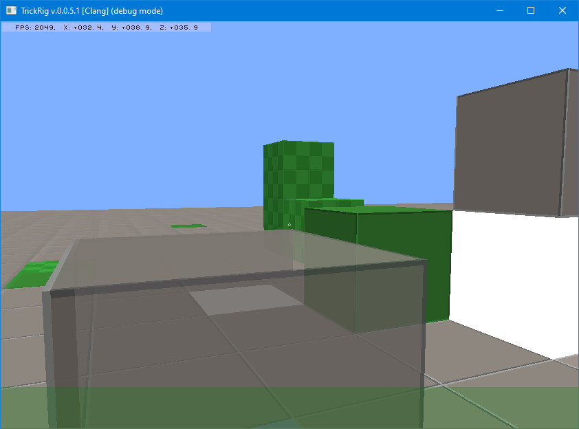

# TRICKRIG
## минималистичный 3D движок

Trickrig - это разрабатываемое на C++ ядро минималистичного графического 3D
движка на основе _OpenGL_, с ипользованием свободных библиотек _glfw3,
libpng16, sqlite3, glm_.
 
Код приложения является мультиплатфоменным. Для сборка на платформе _MS-Windows_
не требуется наличия "Visual Studio" - производится с использованием MSYS2.
На платформе _Linux_ сборки выполняется с использованием "стандартных" средств
разработки.

Подробности на сайте [www.trickrig.net](https://www.trickrig.net)
